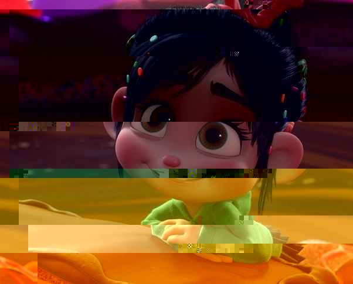

# vanellope
Picture glitcher

| Before | After |
|- | - |
| | |
|command | `vanellope images/pic.jpg images/new_pic.jpg 4 30`

## How to install vanellope
```sh
python setup.py install
```

## Usage
```
❯❯❯ vanellope
Usage: vanellope [OPTIONS] INPUT OUTPUT SEEDS [B_SIZE]
Try "vanellope --help" for help.

Error: Missing argument "INPUT".
```

## TODO
- [ ] Fix tox errors
- [ ] Code more tests
- [ ] Write click messages
- [ ] Add more option to glitch
